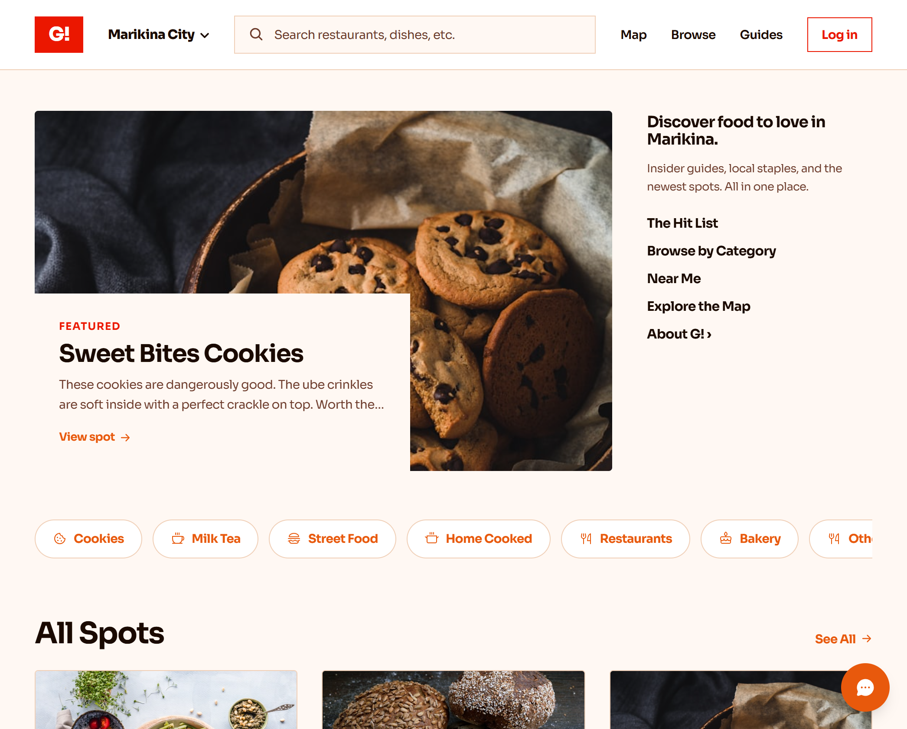
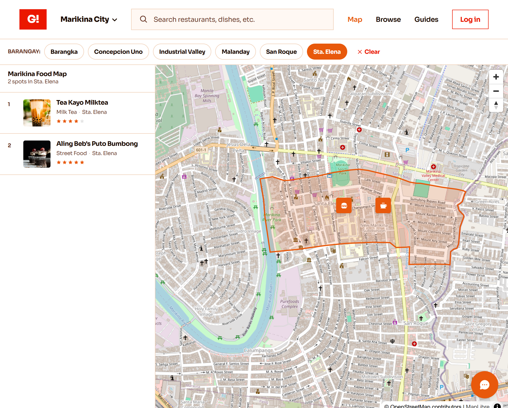
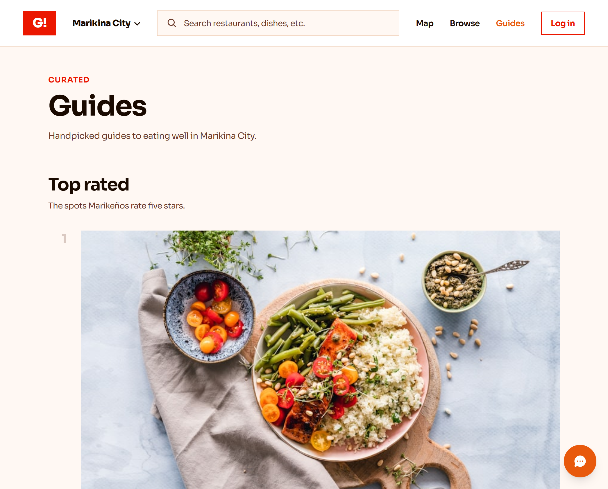

<div align="center">

# G sa Marikina

A food directory for Marikina City, Philippines.

[](https://nextjs.org)
[](https://typescriptlang.org)
[](https://tailwindcss.com)
[](https://clerk.com)
[](https://supabase.com)
[](https://vercel.com)
[](./LICENSE)

<br/>

| Homepage | Map | Listing |
|:---:|:---:|:---:|
|  |  |  |

</div>

---

## Problem

Small food businesses in Marikina City cannot get found online.

Home bakers, milk tea shops, karinderyas, and street vendors post the same product photos to multiple Facebook groups every day. Each post disappears within hours. There is no permanent page they can send to a customer.

Consumers scroll through hundreds of unrelated posts in the same groups, trying to find food nearby. There is no way to search by location, category, or rating.

Existing solutions do not fit:
- **Facebook groups** bury posts in hours. Business owners have no persistent presence.
- **Google Maps** has no menus, no founder reviews, and many small home-based businesses are not listed.
- **Food delivery apps** (GrabFood, FoodPanda) charge 20-30% commission. Many home-based sellers do not do delivery at all.
- **Marikeño (marikeno.com)** writes about Marikina food but does not let business owners self-list.

No self-service food directory exists specifically for Marikina.

---

## Solution

G sa Marikina gives every food business one URL. That URL is the product.

Each business page shows:
- Photos and a menu with prices
- A location map with a "Get directions" link
- Contact buttons (phone, Facebook)
- Customer star ratings and written reviews
- A founder editorial review ("Our take")

Consumers get:
- An interactive map with all listed spots
- Search by keyword, category, barangay, or rating
- "Near Me" sorting by distance
- Curated collections (Top Rated, Hidden Gems, Just Added)

Business owners get:
- A submission form (no technical knowledge needed)
- A dashboard showing submission status, review count, and average rating

The platform operator (me) gets:
- An admin dashboard with platform stats
- A pending submissions queue with approve/reject buttons
- A reported reviews section with keep/remove actions

---

## Scope

This platform is built for:
- **Geography:** Marikina City and nearby areas (Antipolo, Cainta, San Mateo, Montalban)
- **Industry:** Food only. Cookies, milk tea, street food, home-cooked meals, restaurants, bakeries.
- **Users:** Marikina residents looking for food, and small food business owners trying to get found.

This platform does not:
- Process payments or handle delivery (not competing with GrabFood)
- Cover non-food businesses
- Operate outside Metro Manila East

The 16 official barangays of Marikina City are built into the platform as the primary geographic filter.

---

## Privacy and Security

**Data collection:**
- Account info (email, display name) provided at sign-up through Clerk
- Reviews and business submissions the user writes
- Anonymized page-view analytics (Vercel Analytics, no PII)
- Location coordinates (Near Me feature) processed in the browser only, never stored server-side

**What is not collected:**
- No tracking cookies or third-party advertising
- No browsing history stored
- No data sold to third parties

**Authentication and access control:**
- Clerk manages all user identity. Passwords and credentials are stored by Clerk, not in the app database.
- The app database stores only: clerk_id, email, display_name, role.
- `DATABASE_URL` is server-only. Never exposed to the client (no `NEXT_PUBLIC_` prefix).
- API routes verify auth before any write operation. Unsigned requests cannot post reviews or submit businesses.
- The Clerk webhook verifies the svix signature before writing to the database. Invalid signatures are rejected.
- Admin routes check `role = 'admin'` server-side. Non-admin users who navigate to `/admin` are redirected.

**Philippine law compliance:**
- Privacy Policy references the Philippine Data Privacy Act of 2012 (Republic Act 10173).
- Users can request access, correction, or deletion of their personal data.
- Terms of Service, Privacy Policy, and Community Guidelines are accessible at `/terms`, `/privacy`, and `/guidelines`.

**Production notes:**
- Development keys (pk_test/sk_test) are used in the demo. Production deployment should use Clerk production keys (pk_live/sk_live).
- The Clerk publishable key fallback in `layout.tsx` is a build-safety measure only. It does not connect to a real Clerk app.

---

## Features

**Browse**

- Homepage with a featured spot, category filters, and a listing grid
- Map view with category pins, popup previews, and a sidebar list
- Search by keyword, category, barangay, or minimum star rating
- Barangay dropdown in the nav linking to all 16 official Marikina barangays
- Near Me: sorts results by distance from the user's location
- Collections: Top Rated, Hidden Gems, Just Added

**Listing page**

- Hero photo and photo gallery
- Prices menu and founder review
- Star rating summary
- Mini location map with directions link
- Phone and Facebook contact buttons
- Share button (Web Share API on mobile, clipboard on desktop)

**Reviews**

- Signed-in users leave a star rating (1-5) and a written review
- Guests see a sign-in prompt inline

**Business owners**

- Submit a listing at `/for-businesses/new`
- Submissions are stored as `pending` until the admin approves them
- Owner dashboard at `/dashboard` shows status, review count, and average rating

**Admin**

- Stats overview: published businesses, pending submissions, total reviews, total users
- Pending queue: approve or reject submissions
- Reported reviews: keep or remove flagged content

---

## Tech Stack

| Layer | Technology | Notes |
|-------|-----------|-------|
| Framework | Next.js 16 (App Router) | SSG for catalog, dynamic for auth/reviews |
| Language | TypeScript 5 | |
| Styling | Tailwind CSS v4 | Tokens in `:root`, not `@theme` |
| Icons | Phosphor Icons v2 | SSR-safe imports |
| Maps | MapLibre GL JS v5 + react-map-gl v8 | OpenStreetMap tiles, no API key |
| Auth | Clerk v6 | Pinned; v7 breaks imports |
| Database | Supabase (PostgreSQL) | Transaction pooler port 6543 |
| ORM | Drizzle ORM | |
| Validation | Zod | |
| Images | Cloudinary | |
| Hosting | Vercel | |
| Font | Sora | |

---

## Setup

### Requirements

- Node.js 18+
- [Clerk](https://clerk.com) account (free)
- [Supabase](https://supabase.com) project (free)

### Install

```bash
git clone https://github.com/gtapp1/G-sa-Marikina.git
cd G-sa-Marikina
npm install
```

### Environment variables

```bash
cp .env.example .env.local
```

| Variable | Source |
|----------|--------|
| `NEXT_PUBLIC_CLERK_PUBLISHABLE_KEY` | Clerk → API Keys |
| `CLERK_SECRET_KEY` | Clerk → API Keys |
| `CLERK_WEBHOOK_SECRET` | Clerk → Webhooks → Signing Secret |
| `DATABASE_URL` | Supabase → Database → URI (pooler, port 6543) |
| `NEXT_PUBLIC_SITE_URL` | `http://localhost:3000` or your domain |

### Database

```bash
npm run db:push   # create tables
npm run db:seed   # load 7 sample listings
```

### Run

```bash
npm run dev
```

---

## Project Structure

```
src/
├── app/
│   ├── page.tsx                      Homepage
│   ├── [slug]/page.tsx               Listing detail
│   ├── map/                          Map view
│   ├── search/                       Search + filters
│   ├── categories/, category/[id]/   Category pages
│   ├── collections/                  Curated collections
│   ├── near-me/                      Geolocation sort
│   ├── dashboard/                    Owner dashboard (auth)
│   ├── admin/                        Admin dashboard (admin role)
│   ├── for-businesses/new/           Submit a spot (auth)
│   ├── sign-in/, sign-up/            Clerk pages
│   ├── terms/, privacy/, guidelines/ Legal pages
│   └── api/
│       ├── reviews/route.ts          Reviews GET + POST
│       └── webhooks/clerk/route.ts   User sync
├── components/
├── data/
│   ├── listings.ts                   Static catalog (7 spots)
│   └── barangays.ts                  16 official Marikina barangays
├── db/
│   ├── schema.ts                     Drizzle schema
│   └── index.ts                      DB client
├── lib/
│   ├── current-user.ts               Clerk to DB resolver
│   ├── distance.ts                   Haversine
│   └── collections.ts                Derived collections
└── types/listing.ts                  Zod schema + types
```

---

## Data Model

```
users       | clerk_id (unique), email, display_name, role (consumer/business_owner/admin)
businesses  | slug (unique), name, category, barangay, lat/lng, photos[], status (pending/published/rejected)
reviews     | business_id, user_id, rating (1-5), body, is_reported
```

---

## Known Gaps

See [`TODO.md`](./TODO.md) for the full backlog.

- Catalog not unified with DB (approved submissions don't auto-appear in browse)
- Review aggregates show seed values, not DB averages
- No photo upload UI (columns exist)
- 7 sample listings with placeholder images (need 20-30 real spots)
- No automated tests
- No rate limiting on review POST

---

## Future Improvements

**Short-term (next sprint)**
- Unify the catalog with the database so approved submissions appear on all browse surfaces automatically
- Compute real review averages on listing cards from DB data
- Add Cloudinary photo upload widget for business submissions and review photos
- Add one-review-per-user constraint (unique index on business_id + user_id)
- Add rate limiting on `POST /api/reviews`

**Medium-term (pre-public launch)**
- Onboard 20-30 real Marikina food businesses with real photos
- Set up automated tests (Vitest for units, Playwright for E2E)
- "Claim your business" flow: existing curated listings can be claimed by the real owner via email verification
- Email notifications via Resend when a business receives a new review
- Warm-toned custom MapLibre tile style (replace default gray OSM tiles)

**Long-term (post-launch, based on real usage)**
- Trending feed: rank spots by (recent reviews x2 + page views x1) with daily decay
- Barangay boundary polygons on the map (highlight a barangay's real geographic area on selection)
- AI-powered search: natural language queries like "masarap na milk tea malapit sa Sta. Elena"
- Expand to nearby cities (Antipolo, Cainta, San Mateo, Montalban) using the same architecture
- Promoted listings as monetization (only after confirmed product-market fit)
- Mobile app wrapper (PWA or React Native) if mobile usage justifies it

---

## Contributing

1. Create a branch: `git checkout -b feature/your-feature`
2. Verify the build: `npm run build`
3. Open a pull request.

---

## License

MIT. See [LICENSE](./LICENSE)
